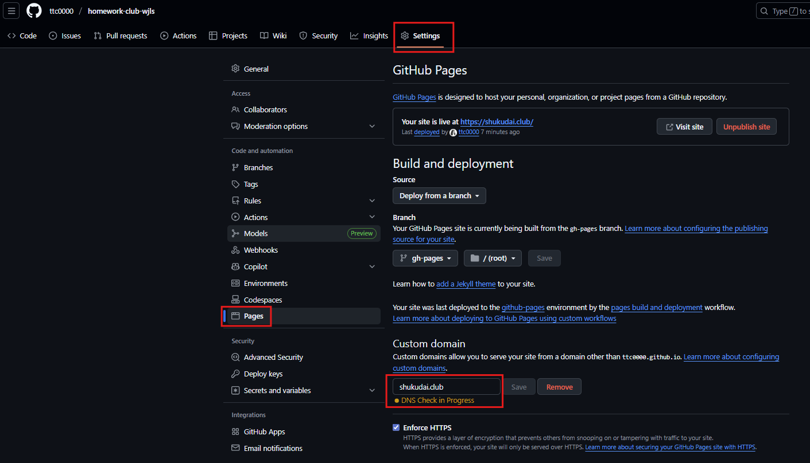

<!--  -->

<!-- 

 -->

## Steps to make changes to the site:

1) Make changes to the code
2) Run `npm run` and make sure the changes are correctly implemented by checking `http://localhost:3000/`
3) Run `npm run predeploy`
4) Run `npm run deploy` which will kick start github action to deploy the changes
5) Go to https://github.com/ttc0000/homework-club-wjls and make sure you save `shukudai.club` in "Custom domain" as shown in the image below

